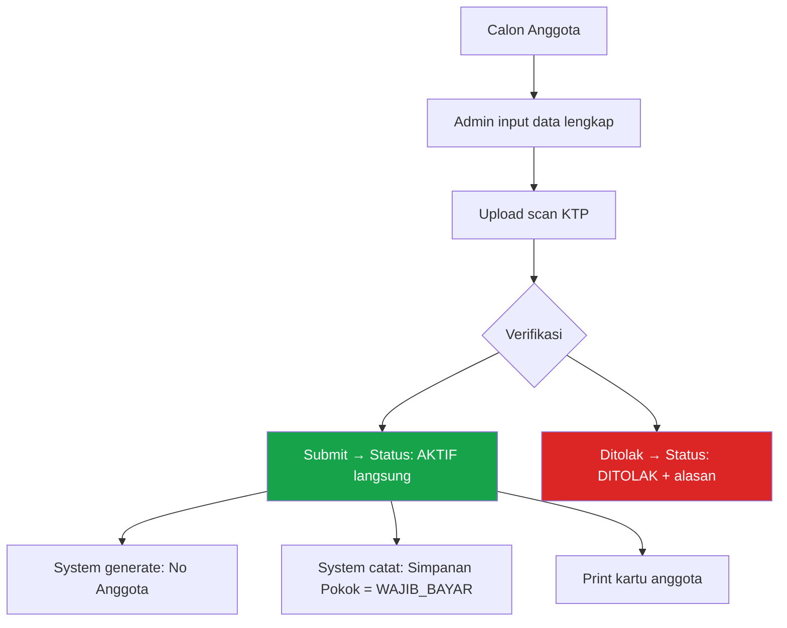
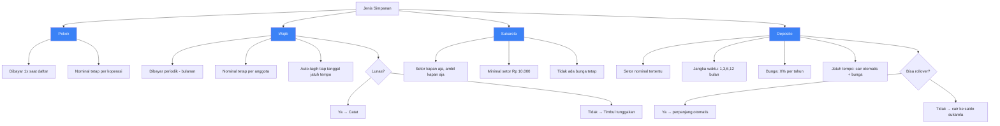
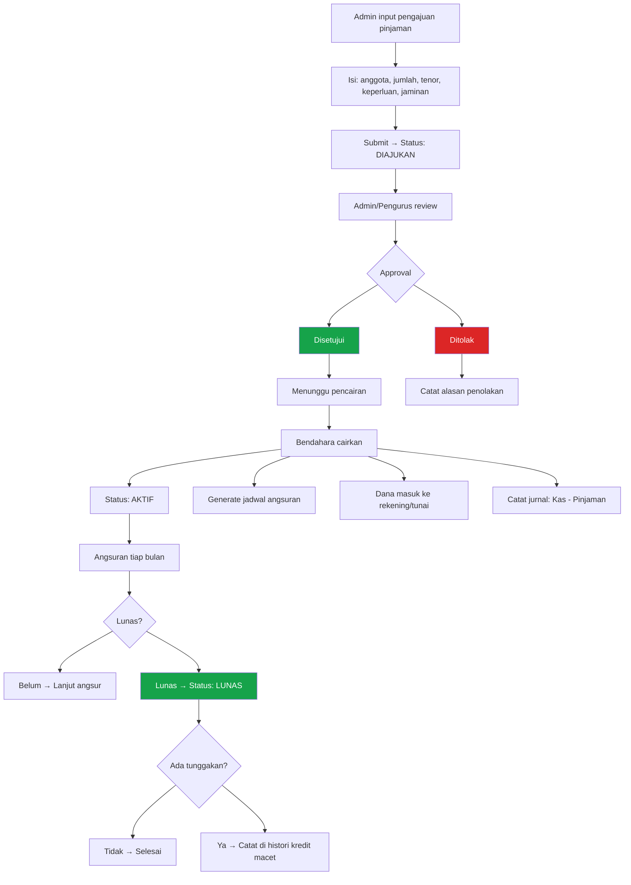
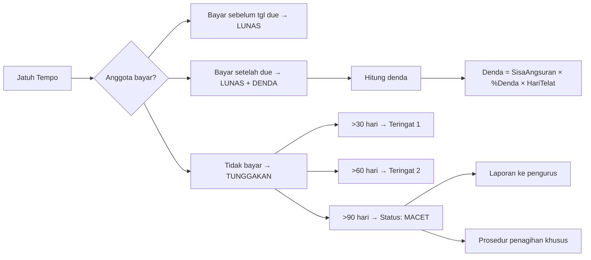
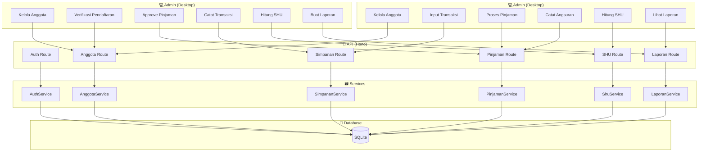

# Flow & Logic — Koperasi Backoffice

---

## Daftar Isi
1. [Flow Pendaftaran Anggota](#1-flow-pendaftaran-anggota)
2. [Flow Simpanan](#2-flow-simpanan)
3. [Flow Pinjaman](#3-flow-pinjaman)
4. [Flow Angsuran & Denda](#4-flow-angsuran--denda)
5. [Flow SHU (Sisa Hasil Usaha)](#5-flow-shu)
6. [Flow RAT (Rapat Anggota Tahunan)](#6-flow-rat)
7. [Flow Pembukuan / Jurnal](#7-flow-pembukuan)
8. [Logic Perhitungan](#8-logic-perhitungan)
9. [State Machine Semua Entity](#9-state-machine)
10. [Data Flow Diagram](#10-data-flow-diagram)

---

## 1. Flow Pendaftaran Anggota



### Alur Detail

**Data yang dikumpulkan:**
| Field | Wajib | Validasi |
|-------|-------|----------|
| NIK (KTP) | ✅ | 16 digit, unique |
| Nama Lengkap | ✅ | Min 3 chars |
| Tempat Lahir | ✅ | |
| Tanggal Lahir | ✅ | Usia >= 17 |
| Alamat | ✅ | |
| Pekerjaan | ✅ | |
| No Telepon | ✅ | Unique, format HP |
| Email | ❌ | Format email |
| Foto KTP | ✅ | Max 2MB, JPG/PNG |
| Pas Foto | ❌ | Max 2MB |

**Status Anggota:**
```
MENUNGGU_VERIFIKASI → AKTIF
                    → DITOLAK
AKTIF → NONAKTIF (keluar/meninggal/dipecat)
```

### Logic Simpanan Pokok Pas Registrasi
```
JIKA anggota daftar via admin:
    → Simpanan Pokok LANGSUNG dicatat (dibayar admin atau nunggu)
    → Status langsung AKTIF
    → Cetak kartu anggota
```

---

## 2. Flow Simpanan



### Logic Tagihan Simpanan Wajib

```
TRIGGER: tiap tanggal 1
UNTUK setiap anggota yg AKTIF:
    BUAT tagihan simpanan wajib bulan ini
    TAMPILKAN di dashboard admin (notifikasi badge)

TRIGGER: tiap tanggal 10 (after due date)
    JIKA tagihan blm dibayar:
        → Status: TUNGGAKAN
        → Tampilkan di laporan tunggakan
        → Kirim notifikasi ke admin

PEMBAYARAN:
    Via tunai → admin catat langsung
    Via transfer → admin verifikasi → catat
    Via auto-debet → sistem catat otomatis
```

### Logic Perhitungan Bunga Deposito
```
BUNGA = (Jumlah × Persentase × JangkaWaktu) / 12

Contoh:
  Deposito: Rp 1.000.000
  Bunga: 6% / tahun
  Jangka: 6 bulan
  
  BUNGA = (1.000.000 × 6% × 6) / 12 = Rp 30.000

  Total cair = 1.000.000 + 30.000 = Rp 1.030.000
```

---

## 3. Flow Pinjaman



### Status Pinjaman (State Machine Detail)

```
DIAJUKAN → DISETUJUI → MENUNGGU_CAIR → AKTIF → LUNAS
DIAJUKAN → DITOLAK
AKTIF → MACET (jika >90 hari tunggakan)
```

### Flow Approval Bertingkat

```
JIKA jumlah pinjaman <= Rp 5.000.000:
    → Approve: Admin cukup
    
JIKA Rp 5.000.000 < jumlah <= Rp 20.000.000:
    → Approve: Admin + Pengurus

JIKA jumlah > Rp 20.000.000:
    → Approve: Admin + Pengurus + Rapat Pengurus
```

### Jenis Bunga Pinjaman

#### a. Bunga Flat
```
Angsuran Pokok = JumlahPinjaman / Tenor
Angsuran Bunga = JumlahPinjaman × Bunga% / 12
Total Angsuran = Angsuran Pokok + Angsuran Bunga (SAMA tiap bulan)

Contoh:
  Pinjaman: Rp 12.000.000
  Bunga: 12% / tahun (1% / bulan)
  Tenor: 12 bulan
  
  Pokok/bln = 12.000.000 / 12 = 1.000.000
  Bunga/bln = 12.000.000 × 1% = 120.000
  Total/bln = 1.000.000 + 120.000 = 1.120.000 (tetap 12x)
```

#### b. Bunga Efektif
```
Angsuran Pokok = JumlahPinjaman / Tenor (SAMA tiap bulan)
Angsuran Bunga = SisaPinjaman × Bunga% / 12 (MENURUN)

Contoh:
  Pinjaman: Rp 12.000.000
  Bunga: 12% / tahun (1% / bulan)
  Tenor: 12 bulan
  
  Pokok/bln = 12.000.000 / 12 = 1.000.000
  
  Bln 1: Bunga = 12.000.000 × 1% = 120.000 → Total: 1.120.000
  Bln 2: Bunga = 11.000.000 × 1% = 110.000 → Total: 1.110.000
  Bln 3: Bunga = 10.000.000 × 1% = 100.000 → Total: 1.100.000
  ...
  Bln 12: Bunga = 1.000.000 × 1% = 10.000 → Total: 1.010.000
```

#### c. Bunga Anuitas
```
Angsuran Total = SAMA setiap bulan
Komposisi Pokok & Bunga = BERUBAH (bunga menurun, pokok meningkat)

Rumus:
  Angsuran = P × (i × (1+i)^n) / ((1+i)^n - 1)
  
  P = Jumlah pinjaman
  i = Bunga per bulan
  n = Tenor
  
Contoh:
  Pinjaman: Rp 12.000.000
  Bunga: 12% / tahun (1% / bulan)
  Tenor: 12 bulan
  
  Angsuran = 12jt × (0.01 × 1.01^12) / (1.01^12 - 1)
           = 12jt × 0.0113 / 0.1268
           = Rp 1.066.182 / bulan (tetap)
```

#### d. Syariah (Bagi Hasil)
```
Bagi hasil menggunakan nisbah (%):
  Nisbah untuk koperasi: 30%
  Nisbah untuk anggota: 70%

  Angsuran = JumlahPinjaman / Tenor + (KeuntunganUsaha × NisbahKoperasi)

Atau pake margin flat (mark-up):
  Harga beli koperasi: Rp 10.000.000
  Margin koperasi: Rp 2.000.000 (20%)
  Harga jual ke anggota: Rp 12.000.000
  Angsuran per bulan: Rp 1.000.000 (12x)
```

---

## 4. Flow Angsuran & Denda



### Logic Perhitungan Denda
```
Denda = SisaAngsuran × (PersentaseDenda / 100) × (HariTelat / 30)

Contoh:
  Angsuran: Rp 500.000
  Denda: 0.5% per bulan (dari sisa)
  Telat: 15 hari
  
  Denda = 500.000 × (0.5/100) × (15/30)
        = 500.000 × 0.005 × 0.5
        = Rp 1.250
```

### Logic Kolektibilitas Pinjaman
```
Kolektibilitas 1: Lancar (0 hari telat)
Kolektibilitas 2: Kurang Lancar (1-90 hari telat)
Kolektibilitas 3: Diragukan (91-180 hari telat)
Kolektibilitas 4: Macet (>180 hari telat)
```

---

## 5. Flow SHU

```mermaid
graph TD
    A[Tutup Buku Tahun] --> B[Hitung Total SHU]
    B --> C[Total SHU = Pendapatan - Beban - Penyusutan - Pajak]
    
    C --> D[Alokasi SHU]
    
    D --> E[Dana Anggota: 40%]
    D --> F[Dana Cadangan: 20%]
    D --> G[Dana Pengurus: 10%]
    D --> H[Dana Pendidikan: 5%]
    D --> I[Dana Sosial: 5%]
    D --> J[Dana Lain-lain: 20%]
    
    E --> K[Bagi ke anggota]
    K --> L[Hitung JMA]
    K --> M[Hitung JUA]
    
    L --> N[JMA = Simpanan × (50% × DanaAnggota / TotalSimpanan)]
    M --> O[JUA = Transaksi × (50% × DanaAnggota / TotalTransaksi)]
    
    N --> P[SHU Anggota = JMA + JUA]
    O --> P
    
    P --> Q[Preview SHU]
    Q --> R[Approval Pengurus]
    R --> S[Buku SHU per Anggota]
    S --> T[Print daftar SHU / Export PDF]
```

### Logic Perhitungan SHU Detail

#### Step 1: Hitung Total SHU
```
SHU TOTAL = Pendapatan Usaha - Biaya Operasional - Penyusutan - Pajak

Pendapatan Usaha:
  + Bunga pinjaman
  + Margin penjualan toko
  + Fee PPOB
  + Pendapatan jasa
  + Pendapatan lain

Biaya Operasional:
  - Gaji pengurus/karyawan
  - Biaya listrik, air, sewa
  - ATK, administrasi
  - Biaya RAT
  - Biaya lain
```

#### Step 2: Alokasi (Contoh)
```
SHU Total: Rp 100.000.000

Alokasi:
  - Anggota: 40% = Rp 40.000.000
  - Cadangan: 20% = Rp 20.000.000
  - Pengurus: 10% = Rp 10.000.000
  - Pendidikan: 5% = Rp 5.000.000
  - Sosial: 5% = Rp 5.000.000
  - Lain-lain: 20% = Rp 20.000.000 (DPD, pembangunan, dll)
```

#### Step 3: Hitung per Anggota
```
Dari 40% untuk anggota (Rp 40.000.000):
  → 50% JMA (Rp 20.000.000) — berdasar simpanan
  → 50% JUA (Rp 20.000.000) — berdasar transaksi

Anggota A:
  Simpanan: Rp 2.000.000
  Total Simpanan Koperasi: Rp 200.000.000
  Belanja/Pinjaman: Rp 5.000.000
  Total Transaksi Koperasi: Rp 500.000.000

JMA = (2.000.000 / 200.000.000) × 20.000.000 = Rp 200.000
JUA = (5.000.000 / 500.000.000) × 20.000.000 = Rp 20.000

SHU A = Rp 200.000 + Rp 20.000 = Rp 220.000
```

### Algoritma SHU (Pseudo)
```
function hitungSHU(periodeId):
    // 1. Ambil semua transaksi periode ini
    pendapatan = sum(transaksi WHERE tipe=pendapatan)
    biaya = sum(transaksi WHERE tipe=biaya)
    totalSHU = pendapatan - biaya
    
    // 2. Hitung alokasi
    danaAnggota = totalSHU × alokasi.anggota_persen / 100
    
    // 3. Bagi ke anggota
    totalSimpanan = sum(simpanan ALL anggota)
    totalTransaksi = sum(pinjaman + penjualan ALL anggota)
    
    for each anggota in anggotaAktif:
        simpananAnggota = sum(simpanan anggota)
        transaksiAnggota = sum(pinjaman + penjualan anggota)
        
        jma = (simpananAnggota / totalSimpanan) × (danaAnggota × 0.5)
        jua = (transaksiAnggota / totalTransaksi) × (danaAnggota × 0.5)
        
        shuAnggota = jma + jua
        
        simpan shuAnggota ke tabel shu_anggota
```

---

## 6. Flow RAT

```mermaid
graph TD
    A[Pengurus buka RAT baru] --> B[Pilih periode buku]
    B --> C[System generate draft laporan]
    C --> D[Neraca]
    C --> E[Laba Rugi]
    C --> F[SHU + Alokasi]
    C --> G[Rencana Kerja tahun depan]
    C --> H[Laporan Pengawas]
    
    D --> I[Pengurus review & edit]
    E --> I
    F --> I
    G --> I
    H --> I
    
    I --> J[Print / export dokumen RAT]
    J --> K[Undangan ke anggota (cetak/digital)]
    K --> L[RAT fisik/online]
    
    L --> M[Voting / musyawarah]
    M --> N[Setuju → catat keputusan]
    M --> O[Tidak setuju → catat saran]
    
    N --> P{Quorum terpenuhi?}
    O --> P
    P --> Q[Ya → RAT sah]
    P --> R[Tidak → perpanjang/jadwal ulang]
    
    Q --> S[Generate notulen]
    S --> T[Arsip RAT]
    T --> U[SHU bisa dibagikan setelah RAT disahkan]
```

### Dokumen RAT yang dihasilkan

| Dokumen | Sumber Data | Format |
|---------|------------|--------|
| Neraca | Akun + Saldo | PDF/XLSX |
| Perhitungan SHU | Transaksi tahun berjalan | PDF |
| Laporan Arus Kas | Transaksi kas + bank | PDF |
| Laporan Pengurus | Manual diisi | PDF |
| Laporan Pengawas | Manual diisi | PDF |
| RAPB tahun depan | Manual + history | PDF |
| Notulen RAT | Hasil voting | PDF |

### Aturan RAT
```
WAJIB dilaksanakan: 1x / tahun
Batas waktu: 31 Maret tahun berikutnya
Quorum: >50% anggota hadir (atau sesuai AD/ART)
Pengesahan SHU: hanya bisa setelah RAT menyetujui
```

---

## 7. Flow Pembukuan

```mermaid
graph TD
    A[Transaksi terjadi] --> B[Tentukan akun debit & kredit]
    B --> C[Buat jurnal]
    C --> D[Post ke buku besar]
    D --> E[Update neraca saldo]
    
    F[Jenis Transaksi] --> G[Simpanan]
    F --> H[Pinjaman]
    F --> I[Angsuran]
    F --> J[Penjualan]
    F --> K[Biaya Operasional]
    
    G --> L[Debit: Kas / Bank]
    G --> M[Kredit: Simpanan Anggota]
    
    H --> N[Debit: Piutang Pinjaman]
    H --> O[Kredit: Kas / Bank]
    
    I --> P[Debit: Kas / Bank]
    I --> Q[Kredit: Piutang Pinjaman (pokok)]
    I --> R[Kredit: Pendapatan Bunga]
    
    J --> S[Debit: Kas / Bank]
    J --> T[Kredit: Penjualan]
    J --> U[Debit: HPP]
    J --> V[Kredit: Persediaan]
    
    K --> W[Debit: Biaya terkait]
    K --> X[Kredit: Kas / Bank]
```

### Chart of Accounts (Contoh)

| Kode | Nama Akun | Tipe | Normal |
|------|-----------|------|--------|
| 1-1000 | Kas | Aset | Debit |
| 1-1100 | Bank BRI | Aset | Debit |
| 1-2000 | Piutang Pinjaman | Aset | Debit |
| 1-3000 | Persediaan Barang | Aset | Debit |
| 2-1000 | Simpanan Pokok | Kewajiban | Kredit |
| 2-1100 | Simpanan Wajib | Kewajiban | Kredit |
| 2-2000 | Simpanan Sukarela | Kewajiban | Kredit |
| 2-3000 | Deposito Anggota | Kewajiban | Kredit |
| 3-1000 | Dana Cadangan | Ekuitas | Kredit |
| 4-1000 | Pendapatan Bunga Pinjaman | Pendapatan | Kredit |
| 4-2000 | Pendapatan Penjualan | Pendapatan | Kredit |
| 5-1000 | Biaya Gaji | Biaya | Debit |
| 5-2000 | Biaya Listrik & Air | Biaya | Debit |
| 5-3000 | Biaya ATK | Biaya | Debit |

---

## 8. Logic Perhitungan

### 8.1 Saldo Simpanan
```
SaldoSimpanan(Anggota) = SUM(Pokok) + SUM(Wajib) + SUM(Sukarela) + SUM(Deposito)

Saldo di dashboard: real-time dari server (via API)
Cache: data terakhir saat online (di browser memory/React Query)
```

### 8.2 Sisa Pinjaman
```
SisaPinjaman = JumlahPinjaman - SUM(AngsuranPokok)

Status:
  Sisa > 0 → Status: AKTIF / MENUNGGAK
  Sisa = 0 + semua bunga lunas → Status: LUNAS
```

### 8.3 Denda Keterlambatan
```
Denda = SisaAngsuran × (PersenDenda/100) × (HariTelat/30)

Dimana:
  HariTelat = HariIni - TanggalJatuhTempo
  PersenDenda = aturan koperasi (contoh: 0.5%/bulan)
```

### 8.4 Kolektibilitas (Kualitas Pinjaman)
```
function getKolektibilitas(pinjaman):
    maxTelat = max(hariTelat dari semua angsuran)
    
    if maxTelat == 0: return 1  // Lancar
    if maxTelat <= 90: return 2 // Kurang Lancar
    if maxTelat <= 180: return 3 // Diragukan
    return 4 // Macet
```

### 8.5 Kesehatan Koperasi
```
Rasio Likuiditas = AsetLancar / KewajibanLancar
  Sehat: > 200%

Rasio Solvabilitas = TotalAset / TotalKewajiban
  Sehat: > 100%

Rasio SHU = SHU / Pendapatan × 100%
  Sehat: > 10%

Partisipasi Anggota = (TotalTransaksiAnggota / TotalTransaksi) × 100%
  Sehat: > 60%
```

---

## 9. State Machine

### Anggota
```
MENUNGGU_VERIFIKASI ── diterima ──▶ AKTIF
MENUNGGU_VERIFIKASI ── ditolak ──▶ DITOLAK
AKTIF ── keluar ──▶ NONAKTIF
```

### Pinjaman
```
DIAJUKAN ── disetujui ──▶ DISETUJUI
DIAJUKAN ── ditolak ──▶ DITOLAK
DISETUJUI ── dicairkan ──▶ AKTIF
AKTIF ── telat >90hr ──▶ MACET
AKTIF ── lunas ──▶ LUNAS
MACET ── pelunasan ──▶ LUNAS
```

### Simpanan Wajib (Tagihan)
```
BELUM_BAYAR ── dibayar ──▶ LUNAS
BELUM_BAYAR ── lewat due ──▶ TUNGGAKAN
TUNGGAKAN ── dibayar ──▶ LUNAS
```

### SHU
```
DRAFT ── konfirmasi ──▶ DIKONFIRMASI
DIKONFIRMASI ── RAT setuju ──▶ DISAHKAN
DISAHKAN ── bagikan ──▶ DIBAGIKAN
```

### RAT
```
DRAFT ── publikasi ──▶ DIPUBLIKASI
DIPUBLIKASI ── voting ──▶ VOTING
VOTING ── quorum ──▶ DISAHKAN
VOTING ── tidak quorum ──▶ DIPERPANJANG
```

---

## 10. Data Flow Diagram



### Flow Request End-to-End

**Contoh: Admin mencatat pengajuan pinjaman**

```
[Admin] POST /api/pinjaman { anggota_id, jumlah, tenor, ... }
    → [API] Auth middleware: verify JWT + role check
    → [API] Validate middleware: Zod schema
    → [API] PinjamanController.create()
    → [Service] PinjamanService.ajukan()
         → Validasi: anggota aktif? limit pinjaman?
         → Insert pinjaman (status: DIAJUKAN)
         → Insert jurnal (Piutang)
         → Notif pengurus: "Ada pengajuan baru perlu approval"
    → [SQLite] INSERT pinjaman + jurnal
    → [Response] { status: "ok", pinjaman_id: "..." }

[Admin/Pengurus] GET /api/pinjaman?status=diajukan
    → Melihat daftar pengajuan

[Admin/Pengurus] PATCH /api/pinjaman/:id/approve
    → [Service] update status: DISETUJUI
    → Notif bendahara: "Pinjaman disetujui, siap dicairkan"

[Bendahara] PATCH /api/pinjaman/:id/cair
    → [Service] update status: AKTIF
    → [Service] generate jadwal angsuran 12 bulan
    → [Service] insert jurnal (Kas - Piutang)
    → Print bukti pencairan
```

---

> **Catatan:** Flow di atas bisa berubah sesuai AD/ART masing-masing koperasi. Semua parameter (bunga, denda, alokasi SHU, limit approval) harus bisa dikonfigurasi via pengaturan.
